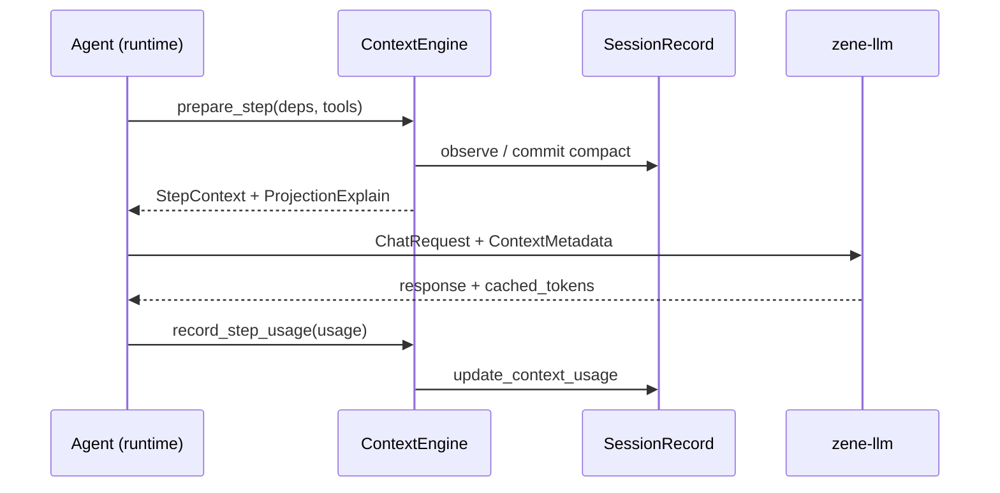

# ContextEngine

Zene 的语义上下文引擎（`crates/context`）。它从 Session 事实算出**这一次**发给模型的视图，不把「模型碰巧看到的 messages」当成会话历史。

相关实现：`zene-context`、`zene-llm` 协议字段、`zene-core` 组装。心智模型见 [session-as-source-of-truth.md](./session-as-source-of-truth.md)；推理协议见 [agent-inference-context.md](./agent-inference-context.md)；compaction 算法细节见 [ENGINE.md](./ENGINE.md)；控制面见 [agent-runtime-optimization.md](./agent-runtime-optimization.md)。

**不在本文范围**：新的 compress 算法、改成 Pi JSONL、把 permission / MCP / Turn 塞进 ContextEngine、为 agent 循环建设全仓 embedding。

**进度（2026-08-13）**：crate 边界、`observe → commit → project`、event-backed projection、前缀三区、Plan/overflow 去改写、prefix-adjacent 注入拖尾已在实现里。代码索引（Select）最小闭环已落地：`zene-index` sidecar + 按需 `RepoMap` 工具。剩余是 legacy fallback 清理，以及 Console 对 `prefixCache` 的展示。

---

## 1. 职责

```
Agent / runtime     turn、tools、permission、steer、审批
Select / 索引       符号图、Repo Map、Grep/Read（工具侧，不进 ContextEngine）
ContextEngine       estimate → compact → memory → assemble → epoch → 前缀布局
推理层              会话亲和、KV / prompt cache、cached_tokens 回传
```

```
zene-session     持久化：events、兼容 messages cache、checkpoints、todos
zene-context     语义上下文：estimate、compact、memory、prefire、epoch、assemble、layout
zene-tools       Grep/Read/Glob/RepoMap；符号查询走 `zene-index`
zene-llm         ChatRequest + ContextMetadata、TokenUsage.cached_tokens
zene-core        composition root
```

依赖：`core → context → {session, llm}`，`llm` 不依赖 `context`。

四层：

| 层 | 名称 | 回答什么 | 谁拥有 |
|----|------|----------|--------|
| L0 | Session Events | 发生过什么 | `zene-session` |
| L1 | Active Branch | 当前叶到根 | session `view` / `try_view` |
| L2 | Context Plan | 如何投影（cut、summary、注入、三区） | `zene-context` |
| L3 | Provider Request | 最终 `messages[]` + metadata | `ContextEngine` → `zene-llm` |

同一份 Session 还可投影出 UI transcript、replay、export；那些不是 ContextEngine 的职责。

---

## 2. API

Runtime 主要调：

| 方法 | 用途 |
|------|------|
| `prepare_step(deps, tools)` | 门面：observe → commit → project |
| `record_step_usage` | water + `cached_tokens` + session 占用 |
| `handle_overflow` | 当前 turn steps-first truncate，不够再完整 compact |
| `compact_forced` | `/compact` |
| `set_step_tail_decorations` | 无 hooks 时的尾巴注入 |
| `on_system_prefix_changed` | 真正改冻结 system 时 `epoch++` |
| `metadata` / `water` | 出站 metadata、`/context` |

`prepare_step` 不再在同一次调用里偷偷既改历史又当唯一真相。三段式：

```text
observe   只读 SessionView，估算 token / water，决定是否 compact
commit    唯一写 Conversation SoT 的入口（CompactionApplied、memory flush、checkpoint）
project   事件路径 → messages；尾巴注入 reminder；full|delta 组装；ProjectionExplain
```

Compact **追加** `CompactionApplied`，不把旧事件从事实日志物理删掉。`SessionRecord.messages` 只是兼容缓存；cache drift 不覆盖 event-backed projection。

`ContextHooks::step_tail_decorations` 是 todos / plan / 后台任务的注入源，写进出站尾巴，不写进 SoT。

---

## 3. 核心类型（现状）

```rust
pub struct StepContext {
    pub messages: Vec<Message>,
    pub metadata: ContextMetadata,
    pub estimate_tokens: u32,
}

pub struct ContextMetadata {
    pub session_id: String,
    pub context_epoch: u64,
    pub prefix_hash: Option<String>,
    pub delivery: ContextDelivery, // full | delta
    pub tail_start: Option<usize>,
}

pub struct ProjectionExplain { /* path / fallback / injected / delivery / prefix_cache */ }
pub struct PrefixCacheExplain {
    pub prefix_end: usize,
    pub body_end: usize,
    pub tail_decoration_count: usize,
    pub prefix_fingerprint: Option<String>,
    pub break_kind: String, // none | compact | system_resize | injected_resize | body_mutate | unknown
    pub cached_tokens: Option<u64>,
    pub unchanged_reprocessed_est: Option<u64>,
}
```

`ChatRequest.context` 与 `TokenUsage.cached_tokens` 在 `zene-llm`。Provider 透传 `X-Zene-Session-Id` / `X-Zene-Context-Epoch`。ACP `projection_update._meta.prefixCache` 带上 zone 与 `breakKind`。

---

## 4. 前缀稳定与 Prefix Cache

厂商 prefix cache 只认：从 prompt 左侧起，连续多少 token 与上一请求 **字节级相同**。`session_id` / `epoch` / `prefix_hash` 是给网关的信号，不能替代字节前缀。

一次 DeepSeek-V4-Pro 诊断（11 次 LLM call，窗口 56.2k）：注入块 `<agent_documents_index>` 只有 698 token，却因 3 次 resize 让约 52k 未变更 token 被重算。位置比体积更贵。

```text
可变内容的位置 ≫ 可变内容的大小
意外打断 ≫ 一次合法 compact
epoch 正确 ≠ 前缀字节稳定
```

### 布局契约

```text
[冻结 system 基座] [pinned / compaction 边界] [只追加的对话 + 工具] [本步装饰]
        ← 稳定前缀：变了才 epoch++ →           ← 只往尾部涨 →         ← 只放尾巴 →
```

实现：`crates/context/src/layout.rs`。`project()` 先把紧贴 pinned 前缀的 reminder 拖到尾巴，再按 hooks 换成当前装饰。历史中间残留的旧 reminder 保持不动（字节冻结）。

索引 / RAG 只允许：开工写入冻结 system（定长或本 session 不再改），或当本步 tail / 工具结果。禁止做成 msg[1] 那种变长块（`InjectionZone::BodyInsert`）。契约见 [§5](#5-代码索引与-select)。

Compact 是 **允许的一次打断**（`epoch++`）。要消灭的是同一会话里 system / 注入块 / 旧 tool 被反复 resize。

### 已落地（Phase P–R）

- 三区：`split_layout` / `PrefixCacheExplain`
- Plan reminder、todos、后台任务走 tail，进出 Plan 不改 system、不 bump epoch
- Overflow 先 `apply_steps_truncate_pass`（当前 user 之后）；不够再完整 compact
- Compact 快照不再持久化 volatile `<system-reminder>`
- Memory 开工写入 system 一次；本步可见的更新走 tail
- Workspace / skills 只在 session start 编进 system
- `break_kind` + `cached_tokens` 进入 explain / ACP（`cached_tokens` 为上一轮 provider 回传）
- Phase S：`InjectionZone`（FrozenPrefix / TailDecorations）；`project()` 把紧贴 pinned 前缀的 reminder 拖到尾巴；debug 断言拒绝 msg[1] 注入块

### 还没做完

| 项 | 说明 |
|----|------|
| `cached_tokens` 当次闭环 | 现在是上一轮回填；UsageUpdate 已有当次值，Console 条形图仍非目标 |
| 旧 compact reminder 在 body 中间 | 保持冻结，不回写；新 compact 不再写入 |
| legacy session fallback | 仅清理可无损迁移的兼容代码 |

Water / auto-compact 仍看窗口占用 `max(usage, estimate)`，不因 cache 命中率推迟 compact。

---

## 5. 代码索引与 Select

模型的窗口装不下真实仓库，代码也不是自然语言。好的做法不是把更多文件预塞进 prompt，而是 **用结构选对、用引擎压缩和排位置**。

这两件事不要合成一个会改写前缀的 documents 块。DeepSeek 诊断里的 `<agent_documents_index>` 就是反例：索引本身只有几百 token，三次 resize 却让约 52k 未变更 token 重算。

| | 回答什么 | 谁做 | 结果放哪 |
|---|---|---|---|
| **Select / 索引** | 该看哪份代码 | 符号图、Repo Map、现有 Grep/Read | 默认当 **工具结果**，长在 Body |
| **ContextEngine** | 怎么塞进窗口、位置别抖 | compact、三区布局、epoch | Prefix / Body / Tail |
| **向量检索** | 用自然语言在多仓里找「像什么的代码」 | Console / 跨仓搜索 | **不进入** agent 主循环 |

索引不进 `zene-context`。ContextEngine 继续只做投影；检索是工具 / workspace sidecar。

```text
Select 选出的东西 ──工具结果──▶ Body（只追加）
ContextEngine ──布局──▶ [冻结 Prefix][Body][本步 Tail]
向量检索 ──▶ Console，不是 agent 的下一跳
```

### 5.1 注入契约

发给模型的视图仍是 §4 的三区。索引命中必须遵守同一条位置规则：

| 位置 | 可以放什么索引 | 条件 |
|---|---|---|
| **冻结 Prefix** | 全库静态地图（极少用） | 开工写入，**本 session 内字节不再变** |
| **Body** | Repo Map、符号命中、Grep/Read | **默认路径**：和普通工具输出一样只追加 |
| **Tail** | 本步工作集提示 | 只活在这一步，不是仓库目录 |
| **禁止** | 变长 `<documents_index>` / msg[1] | `InjectionZone::BodyInsert` 已删除 |

个性化 Repo Map（按当前对话重排）一定走工具结果，不能写进 Prefix：它每步都可能变。

### 5.2 Repo Map 是什么

Repo Map 是给模型看的 **仓库结构地图**，不是源码全文，也不是向量命中列表。思路来自 Aider：

1. tree-sitter 抽出 definition 与 reference（这个文件有哪些函数/类，谁在引用谁）
2. 做成文件/符号图，按当前对话相关文件做个性化 PageRank
3. 在 token 预算内二分，只塞最重要的 **签名和关键定义行**

模型因此知道项目有什么、在哪、怎么互相调用，但看不到完整实现。真正改代码仍靠 Grep/Read 打开文件。Zene 里它应是 **按需工具**，结果进 Body；不要编成每步重写的 system 段。

### 5.3 最小闭环（实现顺序）

现状：JIT 工具已经够用——`Read` / `Grep` / `Glob`（见 [ENGINE.md](./ENGINE.md) 的 agent profile）。缺的是结构化导航，不是第二套上下文引擎。

**下一步（agent 工作区，已落地）**

1. tree-sitter 按语法边界抽符号（函数、类、方法、模块），不要按固定行数切块。
2. 符号图 sidecar：`{workdir}/.zene/index/v1.json`；路径、符号、签名、一行定义；文件 content hash 变了才重解析。
3. `RepoMap` 工具：按 token 预算返回结构地图，输出当工具结果（对话 Body），不写进冻结 Prefix。
4. Grep / Read 仍负责真正打开实现；Explore / Plan mode / 子 agent 均可调用 `RepoMap`。

**明确不做的下一跳**

- 不要在 `project()` 里插入变长仓库目录。
- 不要为每次 Cloud run 建工作区向量库。embedding 要按组织 / commit / ACL 隔离，过期比 Grep 更错，还会诱惑人把命中列表塞回前缀。
- 不要再写一份和 Session 抢真相的 `STATE.md`；决策、compact、todo、plan 已在 event log。
- `AGENTS.md` 已经进冻结前缀：短约定留 system，变长细则走 Skill 按需读。

### 5.4 和 Cloud Code Intelligence 的关系

[产品设计 7.10](../zene-cloud-platform/docs/PRODUCT_AND_SYSTEM_DESIGN.md) 的分期仍然成立：

- **Run 工作区（本文）**：tree-sitter 符号 + 按需 Repo Map + Grep/Read。绑定 workspace version / canonical path。
- **Console 第二阶段**：默认分支增量索引、embedding 跨仓搜索、PR 影响分析。那是产品搜索，不是把 ContextEngine 做强。

Explore 子 agent 继续用 Read/Grep/Glob（加上来的 Repo Map）做调研；主 context 只收摘要。这是 Isolate，不改变三区布局。

---

## 6. 出站：epoch、delta、gateway

已实现行为（原 Phase 0–5）：

- compact 或真正的 system 基座变更 → `epoch++` 并 `PublishPrefix`
- `ZENE_CONTEXT_DELIVERY=full|delta`（配 `ZENE_INFERENCE_GATEWAY_URL` 时默认 delta）
- `pinned_boundary` = `stable_system_boundary`（system + compaction summary）
- 大 tool 输出可句柄化（`ZENE_TOOL_OUTPUT_HANDLES`）
- Cloud Worker 注入 `ZENE_RUN_ID`；Run 结束 `close_session`
- 网关：`apps/inference-gateway`，可选 Redis session store

推理收益三档仍见 [agent-inference-context.md](./agent-inference-context.md)。**A 档**（full messages + 稳定前缀）是 prefix cache 的大头；前缀抖动时 B/C 档也救不了。

---

## 7. 数据流



TurnEngine 只依赖 `ContextAssembler::prepare` / `handle_overflow`；三段式是引擎内部实现。

---

## 8. 剩余工作

- 仅清理可无损迁移的 legacy session fallback
- Console 按产品需求展示 `prefixCache`（非第一版必做彩图）
- Agent-specific runtime wiring 的进一步 crate 化（控制面，见 runtime 文档）
- §5 最小闭环已落地：`zene-index`（tree-sitter 符号图 + hash 增量）与 `RepoMap` 工具；不要为此改 ContextEngine 布局
- 向量检索 / 跨仓 embedding 属于 Console Code Intelligence，不在本文实现范围

---

## 相关文档

- [session-as-source-of-truth.md](./session-as-source-of-truth.md) — Session 事实 vs Context 投影
- [agent-inference-context.md](./agent-inference-context.md) — 与推理层的 session / cache / 续算
- [ENGINE.md](./ENGINE.md) — turn、compaction 算法、memory、sandbox、Grep/Read
- [agent-components.md](./agent-components.md) — 可组装组件栈；索引不进 `zene-context`
- [agent-runtime-optimization.md](./agent-runtime-optimization.md) — 控制面；本文不替代
- [pi-agent-harness-lessons.md](./pi-agent-harness-lessons.md) — Pi 对照
- [PRODUCT_AND_SYSTEM_DESIGN.md](../zene-cloud-platform/docs/PRODUCT_AND_SYSTEM_DESIGN.md) §7.10 — Cloud Code Intelligence 分期

曾拆成 `context-engine-projection.md` 与 `context-engine-prefix-cache.md`，已并入本文。

---

## 讨论记录

### 2026-08-13 — 索引 Select 与 ContextEngine 分家

- 索引服务 Select，ContextEngine 服务 Compress / 布局；禁止变长 documents 块改写前缀。
- 最小闭环：tree-sitter 符号索引 + 按需 Repo Map + 现有 Grep/Read；符号图按文件 hash 增量更新。
- 向量检索归 Console / 跨仓搜索，不是把 agent 做强的下一跳。
- Repo Map 按需当工具结果进 Body；个性化地图不得写入冻结 Prefix。
- 已落地：`zene-index` sidecar（`.zene/index/v1.json`）+ `RepoMap` 工具；不做向量检索。

### 2026-08-13 — 前缀稳定 + 文档合并

- DeepSeek 诊断：msg[1] 注入块 resize 导致约 52k 未变更 token 重算。
- PR #70：三区布局、Plan/overflow 去改写、`prefixCache` 观测。
- Phase S：`InjectionZone`、`project()` 拖走 prefix-adjacent reminder、debug 断言。

### 2026-08-11 — 投影化与 Runtime 对齐

- SoT / 投影四层、`observe|commit|project`、compaction 事件化、ProjectionExplain。
- TurnEngine 只依赖 assembler port；三段式为对内实现。

### 2026-08-10–11 — crate 与网关

- 抽出 `zene-context`；delta / tool handle / `pinned_boundary` / Cloud publish。
- inference-gateway 经 unigateway-sdk session 演进（版本细节见 git 历史）。
