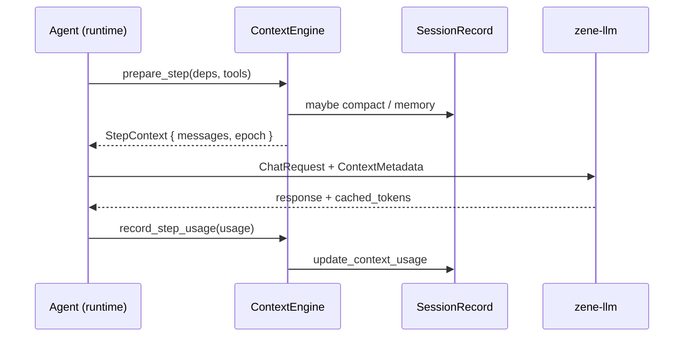

# ContextEngine：上下文解耦设计

本文档是 [agent-inference-context.md](./agent-inference-context.md) 的落地设计，描述如何将 Zene 的语义上下文从 runtime（turn loop、tools、permission）中独立出来。

相关实现：`crates/context/`（`zene-context`）、`crates/llm/`（协议字段）、`crates/core/`（Agent orchestrator）。

可组装组件总览见 [agent-components.md](./agent-components.md)。

---

## 背景

当前 `Agent`（`crates/core`）同时承担 runtime 编排与上下文管理：compaction、water level、prefire、memory flush 等逻辑嵌在 `maybe_compact_before_llm` / `run_llm_step` 中，与 turn、tool、steer 耦合。后续要对接推理层（`session_id` + `context_epoch`、cached_tokens、delta）时，缺少稳定边界。

原则（与 agent-inference-context.md 一致）：

- **Agent / runtime**：turn flow、tools、permission、steer
- **ContextEngine**：estimate → compact → memory → assemble → epoch
- **推理层**：会话亲和、KV/prompt cache、usage 回传

---

## Crate 边界

```
zene-session     持久化：messages、compactions、checkpoints、todos
zene-context     语义上下文：estimate、compact、memory、prefire、epoch、assemble
zene-llm         传输：ChatRequest + ContextMetadata 透传、TokenUsage 含 cached_tokens
zene-core        Runtime：turn loop、tools、permission、steer
```

依赖方向：`core → context → {session, llm, config}`，`llm` 不依赖 `context`。

---

## 核心类型

```rust
/// 出站一步的上下文视图
pub struct StepContext {
    pub messages: Vec<Message>,
    pub metadata: ContextMetadata,
    pub estimate_tokens: u32,
}

/// 推理层协议字段（session_id + epoch）
pub struct ContextMetadata {
    pub session_id: String,
    pub context_epoch: u64,
    pub prefix_hash: Option<String>,
}

pub enum ContextEvent {
    EpochBumped { old: u64, new: u64, reason: &'static str },
    PublishPrefix { epoch: u64, message_count: usize },
    Checkpoint { reason: &'static str },
    CompactionCompleted(CompactionResult),
}

pub struct ContextDeps<'a> {
    pub session: &'a mut SessionRecord,
    pub compaction_config: &'a CompactionConfig,
    pub model: &'a str,
    pub workdir: &'a Path,
    pub client: &'a ChatClient,
    pub background_tasks: &'a [BackgroundTask],
    pub system_prompt: &'a str,
    pub estimator: &'a TokenEstimator,
    pub full_config: &'a ZeneConfig,  // prefire 旁路 LLM 建 client
}
```

---

## ContextEngine API

Runtime 只需调用：

| 方法 | 替代现有逻辑 |
|------|-------------|
| `prepare_step(deps, tools)` | `maybe_compact_before_llm` + `build_messages` |
| `record_step_usage(usage, session, tools, estimator)` | `context_water.record_usage` + session 持久化 |
| `handle_overflow(deps, tools)` | `run_llm_step` 内 overflow compact 分支 |
| `compact_forced(deps, tools, hint)` | `/compact` |
| `metadata(session_id)` | 构造 `ChatRequest.context` |
| `on_system_prefix_changed(reason)` | plan mode / memory 变更 → `epoch++` |
| `clear_prefire()` | rewind / fork |
| `water()` | `/context` 报告、UsageUpdate |

`prepare_step` 内部顺序：assemble → estimate → prefire → steps-first → memory flush → compact → epoch++ → 返回 `StepContext`。

---

## zene-llm 扩展

```rust
pub struct ChatRequest {
    // ... existing fields ...
    pub context: Option<ContextMetadata>,
}

pub struct TokenUsage {
    // ... existing fields ...
    pub cached_tokens: Option<u64>,
}
```

Provider 将 `ContextMetadata` 映射为 `X-Zene-Session-Id` / `X-Zene-Context-Epoch`（或与 PR #42 对齐的 body metadata）。

---

## Agent 字段迁移

| 原 Agent 字段/逻辑 | 归属 |
|-------------------|------|
| `context_water` | `ContextEngine` |
| `prefire` | `ContextEngine` |
| `last_memory_flush_compaction` | `ContextEngine` |
| `compaction.rs` 等 | `zene-context` |
| `record_compaction` | 保留在 Agent（依赖 `AgentRecordWriter`） |
| `tool_bound` | 保留在 core（tool 执行层） |

---

## 迁移分期

### Phase 0 — 协议 glue（可与 Phase 1 并行）

- `ChatRequest.context`、`TokenUsage.cached_tokens`
- Agent 维护 `context_epoch`，compact 后递增
- Provider 透传 header

### Phase 1 — 抽 crate（当前）

- 创建 `zene-context`，迁移 compaction / tokens / water / prefire / memory / two_pass / input_ladder
- 引入 `ContextEngine`，Agent 改调 API，行为不变

### Phase 2 — 协议闭环（当前）

- Worker 注入 `ZENE_RUN_ID` → Agent 自动 `set_external_session_id`
- compact / system 变更 → `epoch++`；网关 `POST /v1/zene/sessions/{id}/publish`（需 `ZENE_INFERENCE_GATEWAY_URL`）
- Run 结束 `Agent::shutdown` → `DELETE /v1/zene/sessions/{id}`
- `cached_tokens` 结构化日志 + ACP `usage_update._meta.cachedTokens` / `contextEpoch`

### Phase 3 — Delta 与 tool handle（当前）

- `assemble_outbound`：`ZENE_CONTEXT_DELIVERY=full|delta`（配 gateway 时默认 delta）
- 出站 metadata：`delivery`、`tail_start`、`prefix_hash`；header `X-Zene-Context-Delivery` 等
- `gateway_prefix_len`：compact/publish 后更新；delta 只传 tail
- `ZENE_TOOL_OUTPUT_HANDLES=1`：大 tool 输出仅传句柄 `[zene-tool-output path=… bytes=…]`

### Phase 4 — 网关（当前）

- 二进制 `zene-inference-gateway`（`apps/inference-gateway`）
- Cloud：`systemd/zene-inference-gateway.service` + VM 本机 Redis（`ZENE_SESSION_REDIS_URL`）
- 生产 session：`FingerprintPolicy=required`（Redis 默认）、idle TTL 1h、max lifetime 24h、size limits
- BYOK：gateway 将客户端 `Authorization: Bearer` 转发 upstream
- `POST /v1/zene/sessions/{id}/publish` / `DELETE ...` / delta chat
- 本地默认内存 store，**不必装 Redis**；需多实例联调时 `export ZENE_SESSION_REDIS_URL=redis://127.0.0.1/`

### Phase 5 — Cloud 与 pinned 协议（当前）

- Worker 注入 `ZENE_INFERENCE_GATEWAY_URL`（CLI / worker 进程 env → ACP 子进程）
- Run 首次 `prepare_step` 时 initial publish（epoch=0），使 delta 从第二步起可用
- `publish` body 增加 `pinned_boundary`（system + compaction summary 下界；网关不得淘汰）

---

## 数据流（Phase 1 后）



---

## 讨论记录

### 2026-08-11 — Cloud gateway + Redis + E2E

- `cloud/deploy`：inference-gateway systemd、startup 安装 redis-server、CI 打包
- 生产 session 配置 env；delta 请求带 `fingerprint`；E2E test `tests/e2e_session.rs`

### 2026-08-11 — unigateway 2.14 接入

- `unigateway-session-redis`：设 `ZENE_SESSION_REDIS_URL` 启用 Redis session store；默认内存
- 依赖升至 `unigateway-sdk 2.14`

### 2026-08-11 — unigateway 2.13 接入

- `session_router` merge（Axum 0.8）；删除手写 publish/delete 路由
- 依赖 `unigateway-sdk 2.13` / `unigateway-session` `http` feature

### 2026-08-11 — unigateway 2.12 接入

- 依赖升至 `unigateway-sdk 2.12` / `unigateway-session 2.12`
- publish body 增加 `fingerprint`（`zene-v1`）与 `message_count`
- gateway middleware：`FingerprintPolicy::Optional`、`TailPositionPolicy::Optional`、namespace `zene`
- delta 请求透传 `tail_start`；header `X-Zene-Tail-Start` 映射至 `_session_context`

### 2026-08-10 — unigateway 2.11 接入

- 依赖升至 `unigateway-sdk 2.11`；`_session_context` + metadata header 转发
- inference-gateway 使用 `unigateway-session` DeltaAssembly + protocol render

### 2026-08-10 — Phase 5 Cloud 与 pinned

- Worker 转发 `ZENE_INFERENCE_GATEWAY_URL`；ContextEngine initial publish
- `pinned_boundary` 写入 publish body（`stable_system_boundary`）

### 2026-08-10 — 网关 stub

- `apps/inference-gateway`：publish / delta assemble / upstream proxy
- `publish_prefix` 携带完整 messages；config 自动路由 LLM 至 gateway

### 2026-08-10 — Phase 3 delta 与 tool handle

- `zene-context::assemble`：full/delta 组装、`prefix_hash`、`gateway_prefix_len`
- `ContextMetadata` 扩展 delivery / tail_start；LLM provider 透传对应 header
- `ZENE_TOOL_OUTPUT_HANDLES`：spill 后句柄化，减少 delta 带宽

### 2026-08-10 — Phase 2 协议闭环

- Worker 注入 `ZENE_RUN_ID`；Agent 启动时绑定 inference session id
- `zene-context::gateway`：`publish_prefix` / `close_session`（`ZENE_INFERENCE_GATEWAY_URL` 可选）
- compact 后 gateway publish；plan mode 等 system 变更 deferred publish 于下次 step
- Usage 观测：`cached_tokens` 日志 + ACP `_meta`
