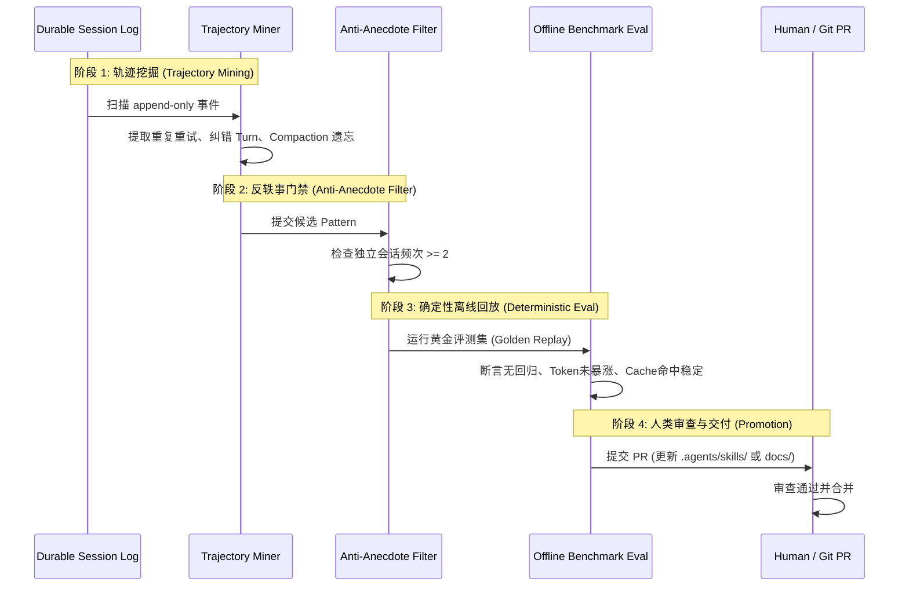

# DeepSeek Harness 架构精髓吸收与 Zene 演化设计方案

> **状态**：Draft  
> **目标**：吸收 DeepSeek Harness（`dsh`）在 Trajectory 事件流、纯函数历史派生、前缀缓存防御性折叠，以及受控闭环进化（Self-Evolution Loop）的核心工程机制，融入 Zene 架构。  
> **关联文档**：[session-as-source-of-truth.md](../session-as-source-of-truth.md)、[context-engine.md](../context-engine.md)、[ENGINE.md](../ENGINE.md)、[architecture.md](../architecture.md)。

---

## 1. 背景与核心价值

DeepSeek Harness（`dsh`）开源所展示的关键突破并非某个单独的 prompt 技巧，而是面向下一代推理模型的**基础设施工程约束**：
1. **Agent = Model + Harness**：模型负责推理，Harness 负责会话状态、执行管线与可观测性；
2. **单一事实来源（Source of Truth）**：只追加的事件日志（Append-only Event Log）是系统唯一真相，模型看到的所有内容必须是从事件日志算出的**纯函数增量投影**（`derive_messages`）；
3. **前缀缓存（Prefix Cache）第一公民**：长上下文折叠能裁剪（Prune）绝不压缩（Compact），压缩是折叠而非砍头，保障 KV Cache 字节级稳定；
4. **受控自我进化（Controlled Self-Evolution）**：事件流是闭环进化的养分，但遵循铁律：**`Self-evolution ≠ Self-authorization`（自我进化不等于自我授权）**。

Zene 作为 Rust 构建的高性能 Headless Agent Harness，在 [session-as-source-of-truth.md](../session-as-source-of-truth.md) 中已确立“Session 是事实，Context 是投影”的心智模型。本文档定义具体的架构升级方案，将上述四大精髓吸收进 Zene 内核。

---

## 2. 总体架构：Zene 演化视图

```
                +-------------------------------------------------------------+
                |             Durable Session Journal (Append-Only)           |
                |   [TurnStart, StepStart, UserMsg, AssistantMsg, ToolCall..]  |
                +-------------------------------------------------------------+
                                       │
                    ┌──────────────────┴──────────────────┐
                    ▼                                     ▼
        +-----------------------+             +-------------------------------+
        | ContextEngine (L2/L3) |             | Offline Distillation Pipeline |
        |  derive_messages()    |             |       (zene-evolve)           |
        +-----------------------+             +-------------------------------+
                    │                                     │
                    ▼                                     ▼
        +-----------------------+             +-------------------------------+
        | Prefix Cache Defense  |             | Anti-Anecdote & Offline Replay|
        | Prune -> Compact ->   |             | (>=2 sessions, Eval Benchmark)|
        | Step-local Retry      |             +-------------------------------+
        +-----------------------+                                     │
                    │                                                 ▼
                    ▼                                 +-------------------------------+
        +-----------------------+                     | Human Promotion (Git PR)      |
        | Model Provider Call   |                     | Update Skills / AGENTS.md     |
        +-----------------------+                     +-------------------------------+
```

---

## 3. 核心设计一：纯函数事件派生（Pure-Function `derive_messages`）

### 3.1 消除双重状态（State Desync）
以往许多 Agent 框架在内存中维护 `messages: Vec<Message>`，并在底层另写一套 telemetry/log。在遇到网络超时、中途取消、分支切换或并发 Step 时，极易出现**模型可见历史与持久化日志脱节**（Log-Reconstruction Desync）。

**Zene 契约**：
- **内存无权威消息状态**：`SessionRecord` 的核心只有只追加事件流 `Vec<SessionEvent>`。
- **纯函数投影**：发送给大模型的实际历史永远由纯函数实时算出：
  `LLM Messages = derive_messages(events: &[SessionEvent], policy: &ProjectionPolicy)`
- **历史增量冻结（Strict Postfix Append）**：前序 Step 派生出的消息在字节上保持不变，新轮次必须是前序请求的**严格后缀追加**，确保 DeepSeek 等 API 的磁盘前缀缓存最大化命中。

### 3.2 两级事件清晰划分（Durable vs Transient）

借鉴 `dsh`，严格隔离两类事件生命周期：

| 类别 | 命名空间/类型 | 持久化策略 | 派生进 LLM 历史 | 典型场景 |
|---|---|---|---|---|
| **持久事实** | `session/event` (`SessionEvent`) | 强制写入磁盘 Append-only Journal | 是（经过滤后投影） | `TurnStart`, `StepStart`, `UserMessage`, `AssistantMessage`, `ToolCall`, `ToolResult`, `CompactionApplied` |
| **临时过程** | `agent/transient` (`RuntimeEvent`) | 内存/实时流订阅（ACP / UI） | **否**（完全隔离） | `PreStepVote`, `AssistantStreamChunk`, `AssistantAttemptFailed`, `ToolApprovalPending` |

**失败与打断隔离原则**：
- 如果 LLM 调用由于用户取消、网络中断或校验失败未生成合法的 Assistant Turn，记为 `AssistantAttemptFailed`（属于过程事件或审计事件）；
- 该失败 **不得** 作为 `AssistantMessage` 注入持久事实日志，避免空内容或残缺 Token 破坏后续 `derive_messages` 的上下文连贯性。

---

## 4. 核心设计二：前缀缓存防御性折叠状态机

DeepSeek API 的磁盘 KV Cache 要求 Prompt 前缀**严格字节级一致**。频繁的系统提示改写、大工具输出颠簸与粗暴截断是缓存命中的头号杀手。

Zene 引入三级防御性折叠与步内自愈状态机（In-Step Recovery State Machine）：

```
[ Step 开始 ]
      │
      ▼
1. Tool Result Pruning ───▶ 未超限 ───▶ 发起 LLM Request
      │ (输出超过阈值截取头4KB+尾1KB)                │
      ▼ (仍逼近窗口 80%)                             │
2. Compaction Basic                            │
      │ (折叠旧历史，保留活跃前缀与尾部 16%)            │
      ▼                                        │
发起 LLM Request ◀─────────────────────────────┘
      │
      ├─ 成功 ──▶ Step 结算
      │
      └─ 返回 CONTEXT_WINDOW_EXCEEDED 错误
            │
            ▼
      3. In-Step Overflow Recovery (步内自愈)
            ├─ (a) 强制触发 Deep Prune
            ├─ (b) 若仍超限执行 Emergency Compact
            └─ (c) 原地重新 derive_messages 并 Retry (调用方无感)
```

### 4.1 级联策略规范
1. **能剪枝（Prune），绝不压缩（Compact）**：
   - 优先通过 `OutputSanitizer` 对超大工具返回（如 `git diff`、构建日志）执行原地局部修剪（保留头 4096 字符 + 尾 1024 字符，中间标注 `... [truncated N bytes] ...`）；
   - 剪枝发生在单个工具结果的视图投影上，**完全不打断前面的历史前缀与 System Prompt**，Cache 全中。
2. **Compaction 是折叠，而非无序砍头**：
   - 当上下文逼近窗口阈值（默认 80%）时触发；
   - 冻结保留最早期 System Base 与最晚近活跃轮次（默认 ~16%），仅将中间已完成的探索性 tool steps 摘要替换为持久的 `CompactionApplied` 事件。
3. **Step 内部捕获 `CONTEXT_WINDOW_EXCEEDED` 自愈**：
   - 当遇到供应商超限报错时，在单个 Step 内部自动按流水线完成“修剪 → 压缩 → 重新派生 → 重试”，不把可恢复的瞬时容量错误直接抛给上层用户。

---

## 5. 核心设计三：受控自我进化闭环（Continuous Evolution Loop）

参考 `dsh-continual-evolve` 与 `oh-my-dsh`，将 Zene 从单纯的单次执行 Harness，升级为具备**经验沉淀与能力演进**能力的自愈工程系统。

### 5.1 核心铁律：Self-Evolution ≠ Self-Authorization
Agent 可以自主**发现瓶颈、挖掘模式、提炼规范与编写候选 Skill**，但**绝对禁止自主修改生产系统的执行代码或全局 Prompt**。所有晋升必须通过标准版本控制、确定性基准测试（Eval Suite）与人类审核。

### 5.2 进化流水线四个阶段



#### 阶段 1：轨迹挖掘（Trajectory Mining）
由离线分析工具 `zene-evolve` 或特定 Skill 驱动，读取归档的 `session.jsonl`，重点挖掘 3 类信号：
1. **工具重复调用与原地重试（Tool Churn）**：
   - 同一工具连打多次（参数仅发生微小变动或持续返回失败）；
   - 提取其最终成功的参数形态，沉淀为该工具的**负向护栏或预检提示**。
2. **用户纠偏动作（Correction Turns）**：
   - 用户在后续 Turn 发出否定指令（如“不要动测试”、“不是改这个文件”）；
   - 分析上一步 Agent 的思维盲区。
3. **Compaction 语义丢失（Context Eviction）**：
   - 压缩后 Agent 反复重新询问已讨论过的架构约束，提取高价值的 Invariant。

#### 阶段 2：反轶事门禁（Anti-Anecdote Filter）
- 严格落实 Zene AGENTS.md 规则：**孤立单次会话的失误禁止上升为全局规则**。
- 候选 Pattern 必须在 >= 2 个不同的独立 Session Trajectory 中被指纹匹配验证，方可生成提案。

#### 阶段 3：确定性离线回放（Deterministic Offline Eval）
- 因为历史事件流是单一事实来源，系统可以在离线环境下构建 **Golden Trajectory 回放集**。
- 候选规则/Skill 生成后，在离线回放集上做静态分析与 Simulation，确保：
  - 静态检查与格式门禁 100% 通过；
  - 没有引入歧义的悬挂引用（Dangling References）；
  - 没有造成前缀缓存的大面积抖动（通过 `PrefixCacheExplain` 断言）。

#### 阶段 4：人类审批交付（Human-in-the-Loop Promotion）
- 演化引擎最终输出的是标准 Git 变更（Pull Request）：
  - 针对高频工程模式：生成或更新 `.agents/skills/<skill-name>/SKILL.md`；
  - 针对通用规则：经人类权衡后，按“加一删一”零和预算补充至 AGENTS.md 或 `docs/governance/`。

---

## 6. 实现演进路线（Implementation Waves）

### Wave 1：纯函数 `derive_messages` 强化与 Desync 校验
- 在 `zene-context` 中强化 `derive_messages(events, policy)` 的纯函数特性；
- 增加 Desync 诊断断言：在 Debug/Test 模式下，校验缓存的 `messages` 与纯函数投影结果的一致性；
- 确保 `AssistantAttemptFailed` 等临时事件不污染持久化事件流。

### Wave 2：三级防御性折叠状态机（Prune → Compact → Step Retry）
- 在 `zene-tools` 与 `ContextEngine` 之间建立统一的 `ToolResultPruner`；
- 增强 `handle_overflow` 状态机，支持在单个 Step 内发生 `CONTEXT_WINDOW_EXCEEDED` 时自动降级重试；
- 在 `PrefixCacheExplain` 中精细化追踪 Prune 与 Compact 引起的缓存失效边界。

### Wave 3：`zene-evolve` 离线轨迹分析与模式提炼
- 建立 `crates/evolve`（或离线工具脚本），提供对 `session.jsonl` 的 Trajectory 扫描能力；
- 实现重复工具错误（Tool Churn）与用户纠偏轮次（Correction Turn）的模式指纹识别；
- 结合现有的 `promote-lesson` 流程，输出标准化候选 PR 草案。
